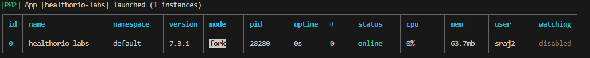

# steps for running

1. Git clone
2. cd frontend
3. npm i
4. npm run build
5. pm2 start ecosystem.config.cjs

it will start running on -> http://localhost:4173/

verify it by checking pm2 list

to stop it pm2 stop healthorio-labs

# Remember to apply update you first need to stop then run above script